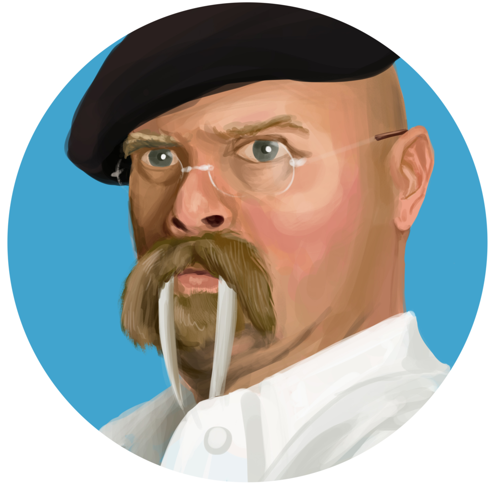

<p align="center">

<b>WaLrUs...</b>
</p>

---

Walrus is a [watermill](https://watermill.io) log adaptor for [logrus](https://github.com/sirupsen/logrus).

## Usage:

```golang

// With no logger 
logger := walrus.New()

// With a specific logger
logger := walrus.NewWithLogger(logrus.StandardLogger())

// With a specific log entry
logger := walrus.NewWithLogger(logrus.StandardLogger().WithField("foo", "bar")

// Example for NATS subscriber
subscriber, err := nats.NewStreamingSubscriber(nats.StreamingSubscriberConfig{}, logger)

// Example for message router
router, err := message.NewRouter(message.RouterConfig{}, logger)
```
